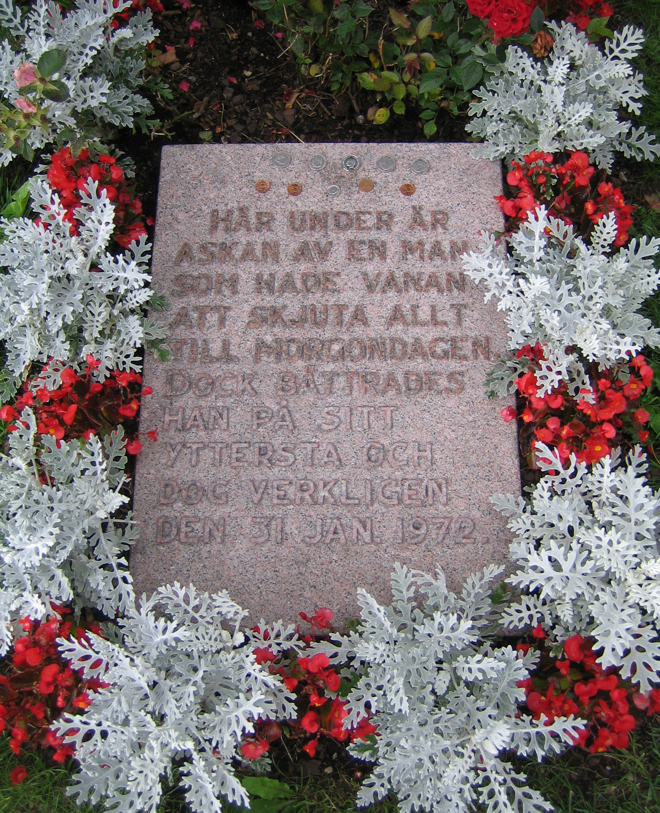
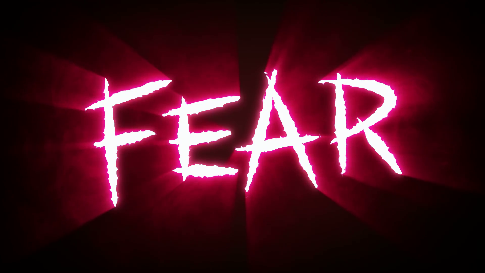
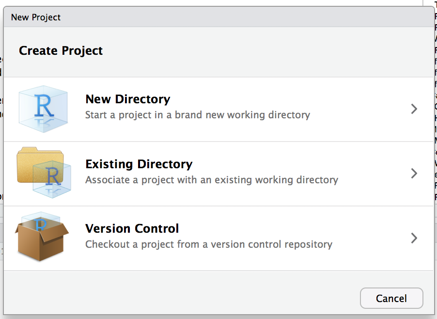
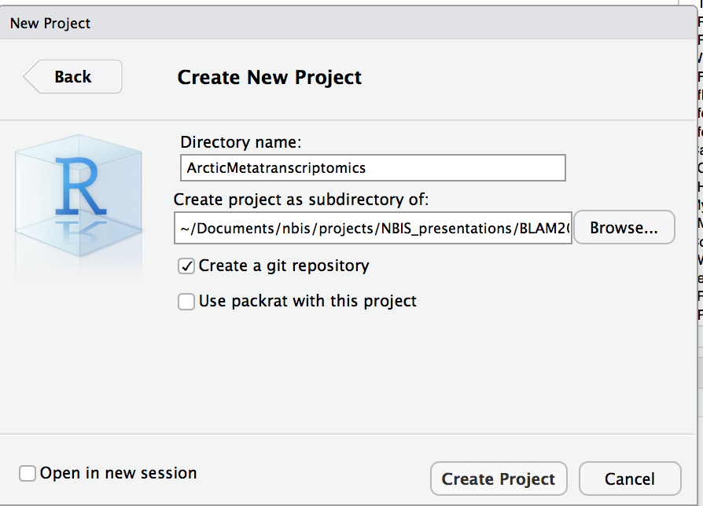
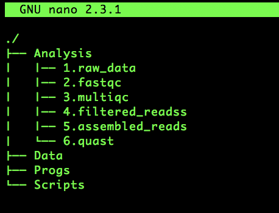

# Data management & Reproducible research
## What is it?
NSF definition from Goodman et al (Science 2016):
*Reproducibility refers to the ability of a researcher to duplicate the results of a prior study using the same materials as were used by the original investigator.*   

Do we agree?

Perhaps we should be talking about "Methods Reproducibility"

> It is not the truth, or even an approximation of truth
> Reproducing the same bias/mistake = same (wrong) results

## Reproducible Research
If most researchers think this is important,   
why are we not working reproducibly?   

What are the obstacles?   

> **Think-Pair-Share**   
> http://www.socrative.com  
> Student login, Room Name :AHREN


# Fritiof Nilsson Piraten
## Fritiof Nilsson Piraten
<section style="text-align: left;">
   
   
- Born 1895 in Vollsjö, Skåne  
- Lund University 1914-1918  
- Lawyer & Book writer  


</section>

## Fritiof Nilsson Piraten



## Translation
<section style="text-align: left;">
**Approximate translation:**   
Here under are the ashes of a man who had the habit of postponing everything to tomorrow.   
However, he bettered himself on his last day in life, and actually died on the 31st of Jan 1972.
</section>


## Procrastination
<br>
<br>
<br>
<br>
<br>
<br>
<br>
<br>
<br>
<br>
<br>
<br>
*I will add a picture for this later...


## Procrastination

> http://www.socrative.com  
> Student login, Room Name :AHREN

# What does Science say?

## 



## Fear
**F: Fusion**
- Fusing the topic with bad thoughts about failure:   
"I can not do this"   
"It is too hard"   
"It will take me too long time"   

## fEar
**E: Excessive Goals**
- We get excited and want to change everything immediately    
This leads to to unrealistic expectations and a high risk of failure!   
 Hard to keep up long term   

## feAr
**A: Avoidance of Discomfort**
- All types of change will feel uncomfortable and unfamiliar at first   
Avoiding discomfort, taking the easy way out (=no change)   
Change is scary!   

## feaR
**R: Remoteness from Values**
- Easy to loose goal and purpose   
"Why am I even doing this?"

# Can we overcome procrastination?
## Can we overcome procrastination?

Note: *Get organised!* does not help!

## How did the comments in Socrative fit with **FEAR** acronym?


# My thoughts on Data management
## My thoughts on Data management 

>- Acknowledge the procrastination psychology   
>- Set realistic goals but do set them   
>- A small step forward is progress!   
>- Set deadline    
>- Share and help each other & give positive feedback (e.g. github repo)   
>-  

# Comments?
## What will I try to cover   

- Project and File structure
- File names
- Version control
- Dos & Don'ts

Possibly discuss (if time allows)
- 
# Lets get to work!   

# Project and File structure   
## Project and File structure  
**Time: 10 minutes plus time for sharing**   

- Make a mind map to visualise the process of one of your projects.   
  Be as detailed as you can regarding files needed and produced. Is external data required?   
  
- How would you like to structure this project? Draw a management plan on a new piece of paper.   
  Include files, folder structure, project structure and external resources required   
  
  - Put the two pieces of paper up for viewing by others.

## Project Setup   

- Update your project and file structure based on the discussions from your peers.

- Start RStudio and make a new project, make sure that the check box for git is checked   
>File -> New Project -> New Directory -> Empty Project

   
   

## Make directories in the Rstudio project
- Create a directory structure using your favourite system:   
>-In your graphical interface (Finder for Mac, Explorer for Windows)   
>-mkdir in terminal (BTW, this can be done inside of RStudio as well)   


## My take on a strategy

- Totally fine if you have another strategy,  
  but remember that chaos does not count as a strategy!!   
  
    

## Project

- Good descriptive name of project, e.g ArcticMetatranscriptome   
- Include information about the goal and reasoning for the project  *README*    
   
   
I always add the following directories/folders into the project directory:   
   
- Data   
- Analysis   
- Docs   
- Scripts   
- Progs   

##  Data
  Read-only, raw data and meta data   
  This is an exact **COPY** of the data at the start of the project   
     
##  Analysis
  Make a separate folder for each of the steps in the analysis
  I like to number them to get a nice order
  
## Docs
  Put documentation (e.g Rmarkdown, Notes etc)   
  
## Scripts
  Scripts, such as sbatch, bash, R scripts etc   
  
## Progs
  Store software installed locally, also keep source code



# Suggested reading:
- Ten simple rules for Reproducible Computational Research (Sandve *et al*, 2013)
- 
## So you have made a Project and File structure

** Now what?**

# Version control
## Git & Github
- What is Git 

- What is GitHub

## Useful links
https://jennybc.github.io/2014-05-12-ubc/ubc-r/session03_git.html

# Dos and don´ts

> http://www.socrative.com  
> Student login, Room Name :AHREN

# Procrastination revisited

# How to succeed?
## How to succeed?
> **Think-Pair-Share**   
> http://www.socrative.com  
> Student login, Room Name :AHREN

## It is all about you!
- Find ways that work for you and stick to them
- Recognise your favourite excuse
_ Resist the temptation of procrastination  
- Move in small steps   
- Set goals that are realistic   


## Use peer pressure (in a positive way)
- Share github repos!
- Meet and discuss your research projects
- Be the spearhead of change in your respective groups!  

```{r, echo=FALSE, out.width='70%', fig.align='center'}
knitr::include_graphics("Presentation/images/spearhead.jpg")
```

# ...
## Conquer the FEAR!
```{r, echo=FALSE, out.width='70%', fig.align='center'}

```